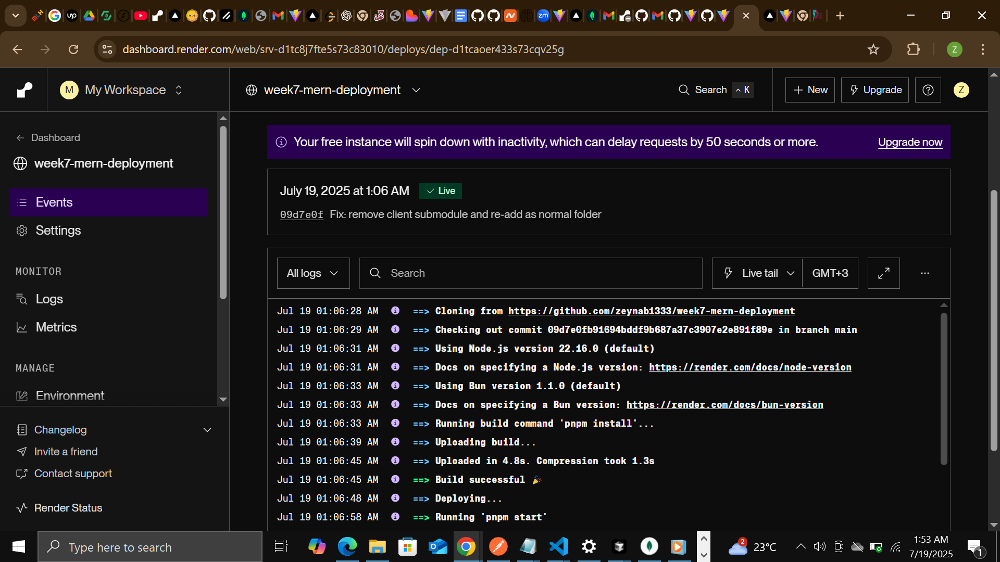
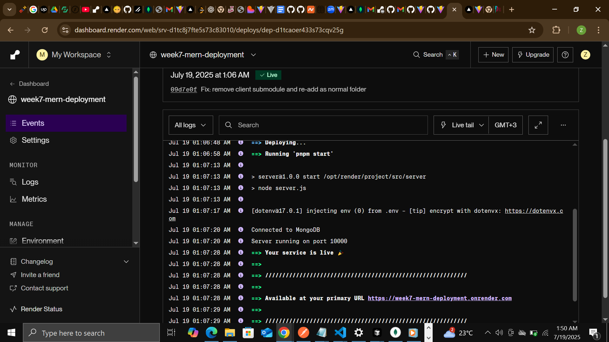
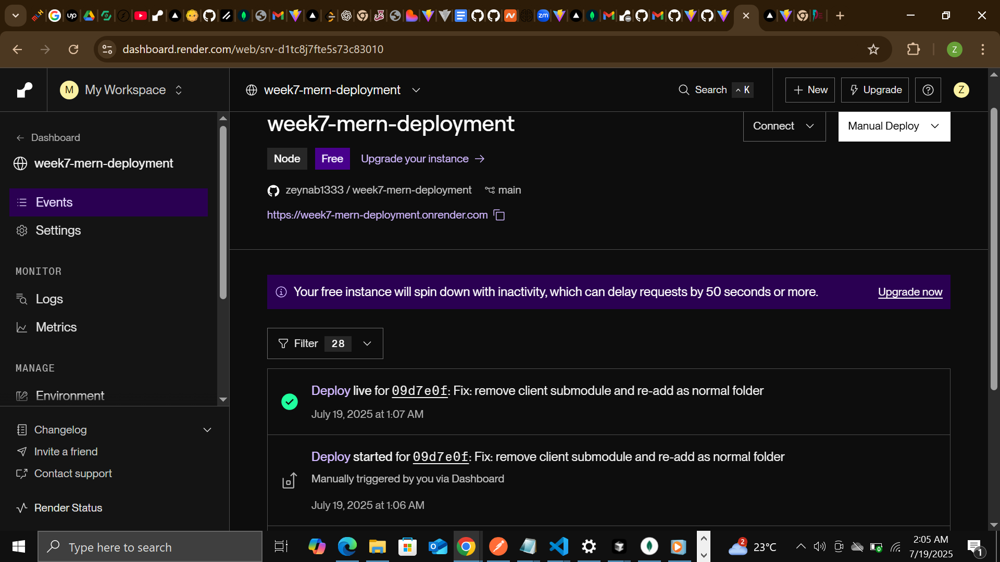

# MERN Blog Application

## 🚀 Deployed Application

- **Frontend:** [https://week7-mern-deployment.vercel.app/](https://week7-mern-deployment.vercel.app/)
- **Backend API:** [https://week7-mern-deployment.onrender.com/api](https://week7-mern-deployment.onrender.com/api)

---

## 🛠️ Setup Instructions

### Prerequisites
- Node.js (v18+)
- MongoDB

### 1. Clone the repository
```bash
git clone <https://github.com/zeynab1333/week7-mern-deployment.git/>
cd <week 4 mern assignment>
```

### 2. Set up the server
```bash
cd server
cp .env.example .env   # Edit .env with your own values
npm install
npm run dev
```

### 3. Set up the client
```bash
cd ../client
npm install
npm run dev
```

### 4. Open the app
- Frontend: [http://localhost:5173](http://localhost:5173)
- Backend API: [http://localhost:5003/api](http://localhost:5003/api)

---

## 🌐 API Documentation

- `GET /api/posts` - List all posts (supports pagination, search, filter)
- `GET /api/posts/:id` - Get a single post
- `POST /api/posts` - Create a post (auth required)
- `PUT /api/posts/:id` - Update a post (auth required)
- `DELETE /api/posts/:id` - Delete a post (auth required)
- `POST /api/posts/:id/comments` - Add a comment (auth required)
- `DELETE /api/posts/:postId/comments/:commentId` - Delete a comment (auth required)
- `GET /api/posts/:id/comments` - Get all comments for a post
- `POST /api/auth/register` - Register a new user
- `POST /api/auth/login` - Login

---

## ✨ Features Implemented

- User registration and login (JWT authentication)
- Protected routes for creating, editing, and deleting posts/comments
- Image upload for post featured images
- Pagination for post list
- Search and filter posts by title/content/category
- Add and delete comments on posts
- Responsive and modern UI

---

## 🖼️ Screenshots

### Home Page

### Post View

### Login Page


---

## ⚙️ CI/CD Pipeline

Below are screenshots of the CI/CD pipeline in action:

### Build & Test


### Deployment


---

## 📈 Monitoring Setup

- **Tool Used:** Render built-in monitoring
- **Metrics Monitored:** Deploy logs, health status, request/response logs
- **Alerting:** No custom alerting configured (Render shows deploy failures and crashes in the dashboard)
- **Dashboard:**  
  

**Setup Steps:**
1. Install and configure the monitoring agent on your server.
2. Connect your application to the monitoring tool.
3. Set up dashboards and alerts for key metrics.
4. Regularly review logs and metrics for anomalies.

---

## 🙌 Author

- Zeynab
- [My GitHub Profile](https://github.com/zeynab1333)

---

## 📄 License

This project is for educational purposes.