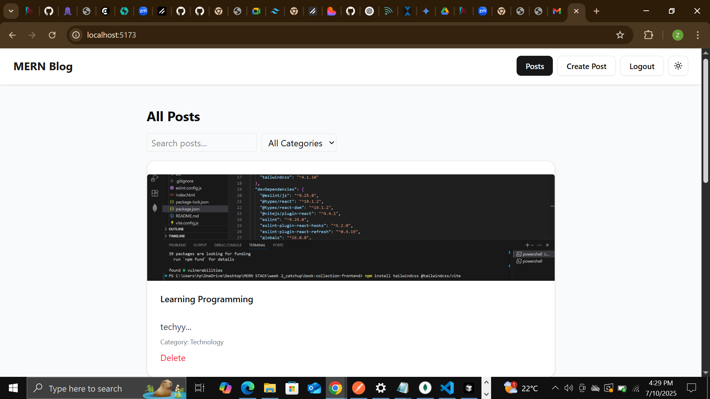
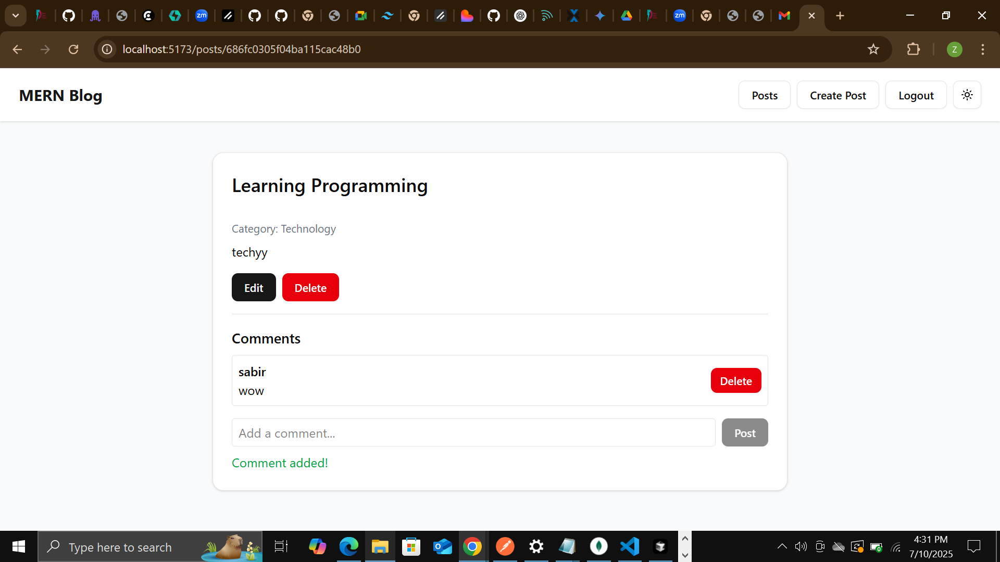
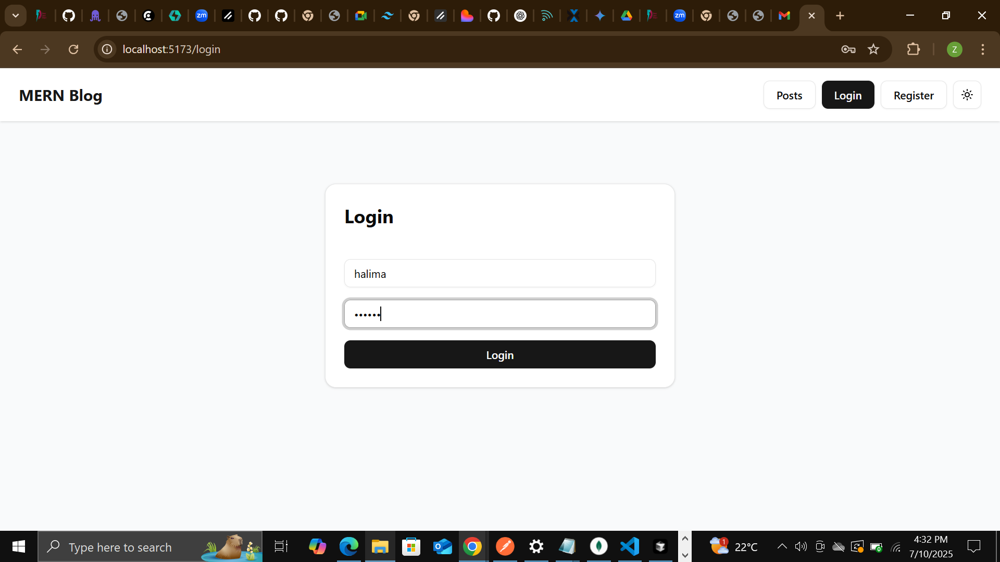

---

## 🛠️ Setup Instructions

### Prerequisites
- Node.js (v18+)
- MongoDB

### 1. Clone the repository
```bash
git clone <your-repo-url>
cd <your-project-folder>
```

### 2. Set up the server
```bash
cd server
cp .env.example .env   # Edit .env with your own values
npm install
npm run dev
```

### 3. Set up the client
```bash
cd ../client
npm install
npm run dev
```

### 4. Open the app
- Frontend: [http://localhost:5173](http://localhost:5173)
- Backend API: [http://localhost:5000/api](http://localhost:5000/api)

---

## 🌐 API Documentation

- `GET /api/posts` - List all posts (supports pagination, search, filter)
- `GET /api/posts/:id` - Get a single post
- `POST /api/posts` - Create a post (auth required)
- `PUT /api/posts/:id` - Update a post (auth required)
- `DELETE /api/posts/:id` - Delete a post (auth required)
- `POST /api/posts/:id/comments` - Add a comment (auth required)
- `DELETE /api/posts/:postId/comments/:commentId` - Delete a comment (auth required)
- `GET /api/posts/:id/comments` - Get all comments for a post
- `POST /api/auth/register` - Register a new user
- `POST /api/auth/login` - Login

---

## ✨ Features Implemented

- User registration and login (JWT authentication)
- Protected routes for creating, editing, and deleting posts/comments
- Image upload for post featured images
- Pagination for post list
- Search and filter posts by title/content/category
- Add and delete comments on posts
- Responsive and modern UI

---

## 🖼️ Screenshots

### Home Page

### Post View

### Login Page


---

## 🙌 Author

- Zeynab
- [Your GitHub Profile](https://github.com/zeynab1333)

---

## 📄 License

This project is for educational purposes.